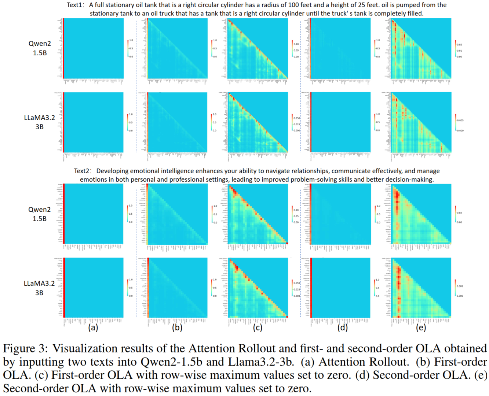

# Order-Level Attention Similarity Across Language Models: A Latent Commonality

 <p align='center'>
  <b>
    <a href="https://arxiv.org/abs/2511.05064">Paper</a>
    |
    <a href="https://neurips.cc/media/PosterPDFs/NeurIPS%202025/117799.png?t=1764063123.996938">Poster</a>
  </b>
</p> 

> **Order-Level Attention Similarity Across Language Models: A Latent Commonality**<br> Jinglin Liang, Jin Zhong, Shuangping Huang*, Yunqing Hu, Huiyuan Zhang, Huifang Li, Lixin Fan, Hanlin Gu  <br>


>**Abstract**: <br> In this paper, we explore an important yet previously neglected question: Do context aggregation patterns across Language Models (LMs) share commonalities? While some works have investigated context aggregation or attention weights in LMs, they typically focus on individual models or attention heads, lacking a systematic analysis across multiple LMs to explore their commonalities. In contrast, we focus on the commonalities among LMs, which can deepen our  nderstanding of LMs and even facilitate cross-model knowledge transfer. In this work, we introduce the Order-Level Attention (OLA) derived from the order-wise decomposition of Attention Rollout and reveal that the OLA at the same order across LMs exhibits significant similarities. Furthermore, we discover an implicit mapping between OLA and syntactic knowledge. Based on these two findings, we propose the Transferable OLA Adapter (TOA), a training-free cross-LM adapter transfer method. Specifically, we treat the OLA as a unified syntactic feature representation and train an adapter that takes OLA as input. Due to the similarities in OLA across LMs, the adapter generalizes to unseen LMs without requiring any parameter updates. Extensive experiments demonstrate that TOA’s cross-LM generalization effectively enhances the performance of unseen LMs. Code is available at https://github.com/jinglin-liang/OLAS. <br>

## 📢 Description
This repository is the official PyTorch implementation of:

[Order-Level Attention Similarity Across Language Models: A Latent Commonality](https://arxiv.org/abs/2511.05064) (NeurIPS 2025).

## 🔨 Requirement
### Environment
```bash
pip install -r requirements.txt -f https://download.pytorch.org/whl/torch_stable.html
```

### Prepare Data
Create a folder named 'datasets', download the dataset, and place it under the file structure as shown below.

datasets  
├── [UD_English-EWT](https://lindat.mff.cuni.cz/repository/items/48b5bcf3-697e-4924-bb2f-29f189491889)  
├── [conll2000](https://huggingface.co/datasets/eriktks/conll2000)  
├── [conll2012](https://huggingface.co/datasets/ontonotes/conll2012_ontonotesv5)  
└── [sem_eval_2010_task_8](https://huggingface.co/datasets/SemEvalWorkshop/sem_eval_2010_task_8)  


### Pre-trained Model
Download the pretrained models and place them in the newly created "pretrained_models" folder.

pretrained_models  
├── [bert-base-cased](https://huggingface.co/google-bert/bert-base-cased)  
├── [bert-large-cased](https://huggingface.co/google-bert/bert-large-cased)  
├── [roberta-base](https://huggingface.co/FacebookAI/roberta-base)  
├── [roberta-large](https://huggingface.co/FacebookAI/roberta-large)  
├── [electra-base-generator](https://huggingface.co/google/electra-base-generator)  
├── [electra-large-generator](https://huggingface.co/google/electra-large-generator)  
├── [gemma-2-2b-it](https://huggingface.co/google/gemma-2-2b-it)  
├── [gemma-2-9b-it](https://huggingface.co/google/gemma-2-9b-it)  
├── [Qwen2-1.5B-Instruct](https://huggingface.co/Qwen/Qwen2-1.5B-Instruct)  
├── [Qwen2-7B-Instruct](https://huggingface.co/Qwen/Qwen2-7B-Instruct)  
├── [Llama-3.1-8B-Instruct](https://huggingface.co/meta-llama/Llama-3.1-8B-Instruct)  
└── [Llama-3.2-3B-Instruct](https://huggingface.co/meta-llama/Llama-3.2-3B-Instruct)  

## 📺 Qualitative Empirical Evidence of OLAS

Run the code below to visualize OLA. An example of the visualization result is shown in the figure below.

```bash
python main.py configs/visual_clms.json
```



## 🍔 Quantitative Empirical Evidence of OLAS 

### Quantitative Analysis Based on Visual Model

**First, run the following code to generate the OLA data for quantitatively evaluating cross-model similarity.**

- CLMs

```bash
python main.py configs/gendata_clm_conll2012en_entity.json --do_classify_data_generate
```
- MLMs

```bash
python main.py configs/gendata_mlm_conll2012en_entity.json --do_classify_data_generate
```

**Then, run the following code to train the visual model and perform the objective similarity evaluation.** The 'train_model_names' and 'test_model_name' parameters allow you to specify the source model(s) and the target model(s), respectively.

- CLMs

```bash
python olas_visual_model.py \
  --train_model_names \
  Qwen2-1.5B-Instruct Qwen2-7B-Instruct Llama-3.2-3B-Instruct Llama-3.1-8B-Instruct \
  --test_model_names \
  gemma-2-2b-it gemma-2-9b-it
```

- MLMs

```bash
python olas_visual_model.py \
  --train_model_names \
  bert-base-cased bert-large-cased roberta-base roberta-large \
  --test_model_names \
  electra-base-generator electra-large-generator
```

###  Quantitative Analysis Based on Image Similarity Retrieval

- CLMs

```bash
python olas_retrieval.py \
  --src_model Qwen2-1.5B-Instruct \
  --tgt_model Llama-3.2-3B-Instruct
```

- MLMs

```bash
python olas_retrieval.py \
  --src_model bert-base-cased \
  --tgt_model electra-base-generator
```

## 🚀 Transferable OLA Adapter

### Training

**First, run the following code to generate the OLA dataset.**

- CLMs

```bash
python main.py configs/gendata_clm_conll2012en_entity.json
```

- MLMs

```bash
python main.py configs/gendata_mlm_conll2012en_entity.json
```

**Secondly, train ola adapter using generated ola data**

- CLMs

```bash
CUDA_VISIBLE_DEVICES=0 python main.py configs/train_qwen_1b_conll2000pos.json --use_generated_oladata true
```

- MLMs

```bash
CUDA_VISIBLE_DEVICES=0 python main.py configs/train_bert_base_conll2012en_entity.json --use_generated_oladata true
```

### Testing

- CLMs

```bash
CUDA_VISIBLE_DEVICES=0 python main.py configs/eval_clm_conll2012en_entity.json --eval_adapter_checkpoint path_to/ola_adapter_weight.bin
```

- MLMs

```bash
CUDA_VISIBLE_DEVICES=0 python main.py configs/eval_mlm_conll2012en_entity.json --eval_adapter_checkpoint path_to/ola_adapter_weight.bin
```

## ❤️ Citation
If you find our work inspiring or use our codebase in your research, please cite our work:
```
@inproceedings{liang2025order,
  title={Order-Level Attention Similarity Across Language Models: A Latent Commonality},
  author={Liang, Jinglin and Zhong, Jin and Huang, Shuangping and Hu, Yunqing and Zhang, Huiyuan and Li, Huifang and Fan, Lixin and Gu, Hanlin},
  booktitle={The Thirty-ninth Annual Conference on Neural Information Processing Systems},
  year={2025}
}
```
